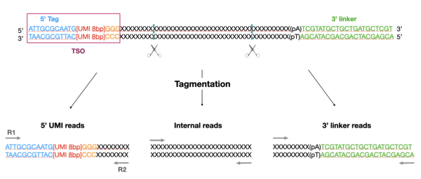

# SmartSeq3 | {width=1in}

**Institut Curie - Nextflow SmartSeq3 analysis pipeline**

[](https://www.nextflow.io/)
[](https://multiqc.info/)
[](https://conda.anaconda.org/anaconda)
[](https://singularity.lbl.gov/)
[](https://www.docker.com/)

### Introduction

The pipeline was built using [Nextflow](https://www.nextflow.io), a workflow tool to run tasks across multiple compute infrastructures in a very portable manner. 
It comes with containers making installation trivial and results highly reproducible.

### Pipeline Summary

The aim of the SmartSeq3 is to combine a full-length transcriptome coverage and a 5' UMI counting strategy to allow a better characterisation of single-cell transcriptomes. To do so, a template-switching oligo (TSO) is added in 5' parts of mRNAs (cf. figure below). The TSO is used for reverse transcription and Tn5-based tagmentation that randomly cut cDNAs. This leads to three types of reads: 5'UMI reads, internal reads and 3' linker reads. Finally, these reads are sequenced in a paired-end fashion and analyzed by this bioinformatic pipeline. 




1. Get R1 reads having a 5' tag to catch UMI reads ([`seqkit`](https://bioinf.shenwei.me/seqkit/))
2. Extract UMIs from tagged reads ([`umi-tools`](https://umi-tools.readthedocs.io/en/latest/))
3. Trim 3' linker and polyA tails on R2 reads ([`cutadapt`](https://cutadapt.readthedocs.io/en/latest/index.html))
4. Read alignments on R1+R2 ([`STAR`](https://github.com/alexdobin/STAR))
5. Read assignments on R1+R2 ([`FeatureCounts`](https://bioconductor.org/packages/release/bioc/vignettes/Rsubread/inst/doc/SubreadUsersGuide.pdf))
6. Generation of UMI count matrices ([`umi-tools`](https://umi-tools.readthedocs.io/en/latest/))
7. BigWig generations ([`bamCoverage`](https://deeptools.readthedocs.io/en/develop/content/tools/bamCoverage.html))
8. Estimate gene body coverage ([`genebody_coverage`](http://rseqc.sourceforge.net/))
9. Generate cell QC plots (#UMIS per cell, %MT transcrits per cell, UMI & Gene per cell)
10. Generate a 10X format matrix with all cells
11. Results summary ([`MultiQC`](https://multiqc.info/))


### Quick help

```bash

N E X T F L O W  ~  version 20.01.0
======================================================================
SmartSeq3 v.1.0
======================================================================

Usage:

nextflow run main.nf --reads '*_R{1,2}.fastq.gz' -profile conda --genomeAnnotationPath '/data/annotations/pipelines' --genome 'hg38'
nextflow run main.nf --samplePlan 'sample_plan.csv' -profile conda --genomeAnnotationPath '/data/annotations/pipelines' --genome 'hg38'

Mandatory arguments:
    --reads [file]                Path to input data (must be surrounded with quotes)
    --samplePlan [file]           Path to sample plan input file (cannot be used with --reads)
    --genome [str]                Name of genome reference
    -profile [str]                Configuration profile to use. test / conda / multiconda / path / multipath / singularity / docker / cluster (see below)
  
  Inputs:
    --starIndex [dir]             Index for STAR aligner
    --singleEnd [bool]            Specifies that the input is single-end reads

  Skip options: All are false by default
    --skipSoftVersion [bool]      Do not report software version
    --skipMultiQC [bool]          Skips MultiQC
    --skipGeneCov [bool]          Skips calculating genebody coverage
  
  Genomes: If not specified in the configuration file or if you wish to overwrite any of the references given by the --genome field
  --genomeAnnotationPath [file]      Path  to genome annotation folder

  Other options:
    --outDir [file]               The output directory where the results will be saved
    -name [str]                   Name for the pipeline run. If not specified, Nextflow will automatically generate a random mnemonic
 
  =======================================================
  Available Profiles

    -profile test                Set up the test dataset
    -profile conda               Build a single conda for with all tools used by the different processes before running the pipeline
    -profile multiconda          Build a new conda environment for each tools used by the different processes before running the pipeline
    -profile path                Use the path defined in the configuration for all tools
    -profile multipath           Use the paths defined in the configuration for each tool
    -profile docker              Use the Docker containers for each process
    -profile singularity         Use the singularity images for each process
    -profile cluster             Run the workflow on the cluster, instead of locally
```

### Quick run

The pipeline can be run on any infrastructure from a list of input files or from a sample plan as follow

#### Run the pipeline on a test dataset
See the conf/test.conf to set your test dataset.

```
nextflow run main.nf -profile test,conda

```

#### Run the pipeline from a `sample plan`
```
nextflow run main.nf --samplePlan MY_SAMPLE_PLAN --genome 'hg19' --genomeAnnotationPath ANNOTATION_PATH --outDir MY_OUTPUT_DIR

```

### Defining the '-profile'

By default (whithout any profile), Nextflow will excute the pipeline locally, expecting that all tools are available from your `PATH` variable.

In addition, we set up a few profiles that should allow you i/ to use containers instead of local installation, ii/ to run the pipeline on a cluster instead of on a local architecture.
The description of each profile is available on the help message (see above).

Here are a few examples of how to set the profile option.

```
## Run the pipeline locally, using a global environment where all tools are installed (build by conda for instance)
-profile path --globalPath INSTALLATION_PATH

## Run the pipeline on the cluster, using the Singularity containers
-profile cluster,singularity --singularityPath SINGULARITY_PATH

## Run the pipeline on the cluster, building a new conda environment
-profile cluster,conda --condaCacheDir CONDA_CACHE

```

### Sample Plan

A sample plan is a csv file (comma separated) that list all samples with their biological IDs.
The sample plan is expected to be created as below :

SAMPLE_ID | SAMPLE_NAME | FASTQ_R1 [Path to R1.fastq file] | FASTQ_R2 [For paired end, path to Read 2 fastq]

### Full Documentation

1. [Installation](docs/installation.md)
2. [Reference genomes](docs/reference_genomes.md)
3. [Running the pipeline](docs/usage.md)
4. [Output and how to interpret the results](docs/output.md)
5. [Troubleshooting](docs/troubleshooting.md)

#### Credits

This pipeline has been written by the single cell & bioinformatics platform of the Institut Curie (Louisa Hadj Abed, Celine Vallot, Nicolas Servant)

#### Contacts

For any question, bug or suggestion, please use the issues system or contact the bioinformatics core facility.
