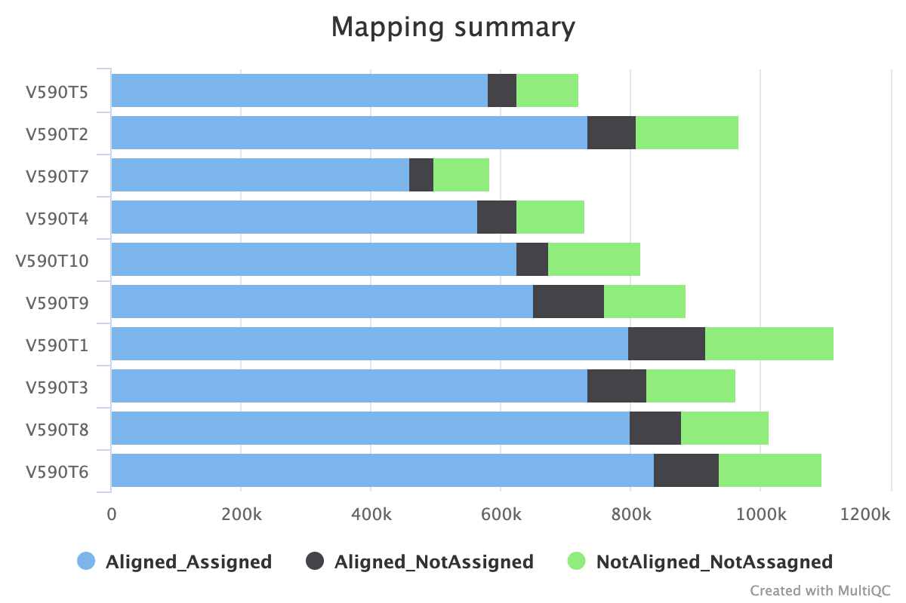
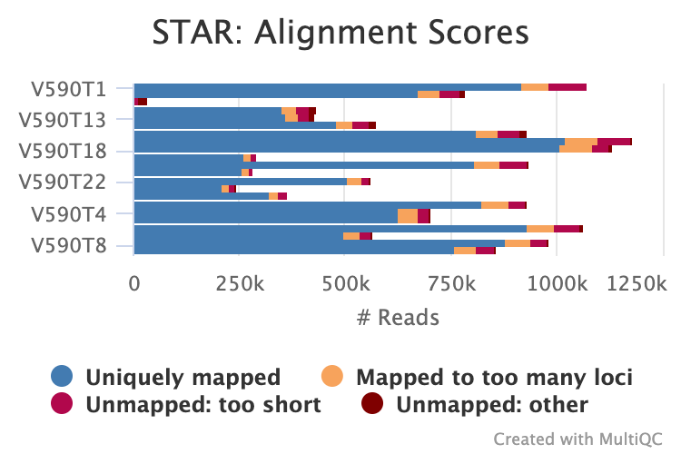
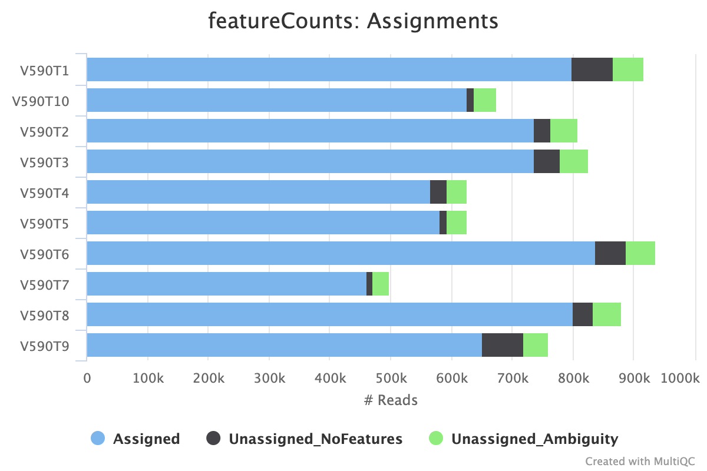
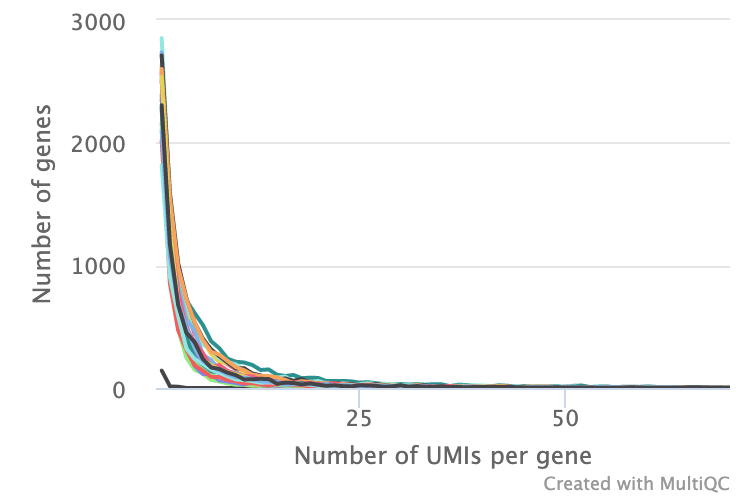
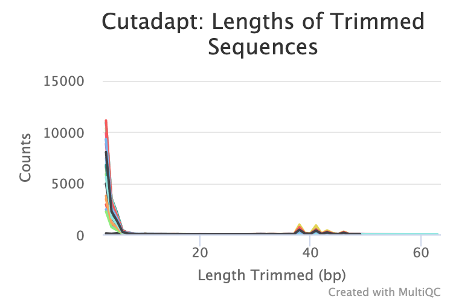
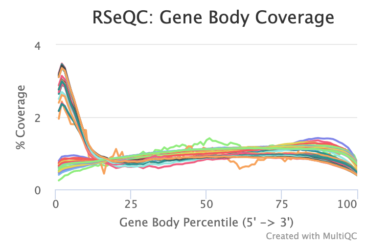
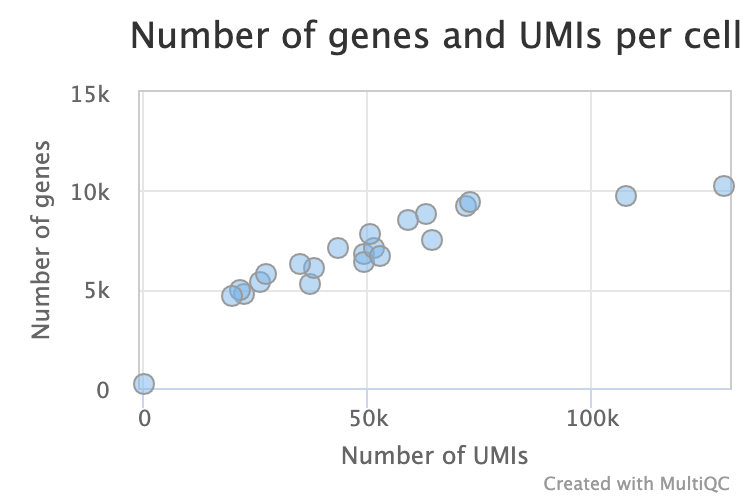
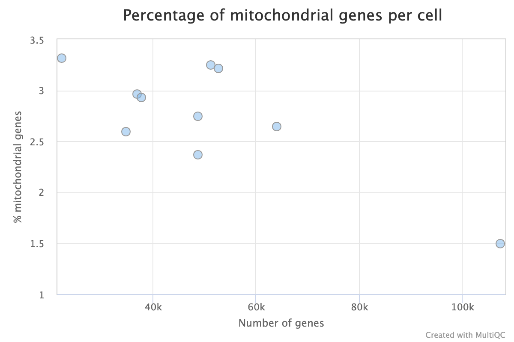

# Outputs

This document describes the output produced by the pipeline. Most of the plots are taken from the MultiQC report, which summarises results at the end of the pipeline.

## Pipeline overview

The pipeline is built using [Nextflow](https://www.nextflow.io/)
and processes the data using the steps presented in the main README file.  
Briefly, its goal is to process single cell RNAseq data obtained with smartSeq3 protocol.

The directories listed below will be created in the output directory after the pipeline has finished. 

The first part (Reads mapping) focus on reads QC and the second part (Cell viability) explores umi and gene level.

## Reads mapping

### Mapping summary

The mapping summary part summarises alignement and assignment steps as follow:

- **Aligned_Assigned** : successfully aligned and assigned reads that are used for further analysis.  
- **Aligned_NotAssigned** : reads corresponding to one genome location but can't be assigned to a gene. 
- **NotAligned_NotAssigned** : bad quality reads.

Alignment and assignment are described more in details in the two following parts.

### Alignment

[STAR](https://physiology.med.cornell.edu/faculty/skrabanek/lab/angsd/lecture_notes/STARmanual.pdf) software is used to aligned reads to a reference genome. Alignment statistics show the total number of reads in each sample and their alignment results as follow :

- **Uniquely mapped** : successfully aligned reads.  
- **Mapped too many** : reads map to more than 1 loci. 
- **Unmapped too short** : less than 66% of reads length (R1+R2) are correctly aligned on the genome. 
- **Unmapped other: other** : other reason than "too short" or "too many" like for example due to a foreign genome contamination or if reads came from a
from a higly repeated region. 

**Output directory: `readAlignment`**

* `[sample]Aligned.sortedByCoord.out.bam`
  * Aligned reads save as BAM (Binary Alignment Map) file.
* `[sample]Log.final.out, [sample]Log.progress.out, [sample]Log.out`
  * Log files that sum up read alignements processing.

### Assignment

[FeatureCounts](https://bioconductor.org/packages/release/bioc/vignettes/Rsubread/inst/doc/SubreadUsersGuide.pdf) tool is used to assign reads to genes. Assignment statistics show the total number of reads in each sample and their assignment results as follow :

- **Assigned** : successfully assigned reads to genes.
- **Unassigned_NoFeatures** :  read alignments that do not overlap any exon (feature).
- **Unassigned_Ambiguity** : read alignments that overlap two or more exons (features) or genes (meta-features).

**Output directory: `readAssignment`**

* `[sample]Aligned.sortedByCoord.out.bam.featureCounts.bam`
  * Assignment results added to previous alignment file. The BAM file now have tagged reads as "Assigned" or "Unassigned". 
* `[sample]_counts.summary`
  * Assignment statistics summary.

From the aligned and assigned reads, the pipeline runs several quality control steps presented below.

### Number of UMIs per gene

To visualise the number of UMIs per gene in each sample, their distributions are plot as follow. An upper limit of 70 UMIs (x axis) is set to allow a better representation.

**Output directory: `umiPerGeneDist`**

* `[sample]_umi_HistUMIperGene_mqc.csv`
  * Tables of each distribution curve. First column is the number of UMIs, second column is the number of genes.

### Cutadapt

[Cutadapt](https://cutadapt.readthedocs.io/en/stable/) is used to trim 3' linker and polyA tails. 
Results are summurized in an plot as follow:

**Output directory: `trimReads`**

* `[sample]_trimmed.R1.fastq`, `[sample]_trimmed.R2.fastq`
  * Fastq with deleted linker and polyA. 
* `[sample]_trimmed.log`
  * Log file summurizing reads trimming.

### Gene body coverage

[Gene body coverage](http://rseqc.sourceforge.net/#genebody-coverage-py) script (from [RSeQC](http://rseqc.sourceforge.net/) package) is used to show how overall reads within a cell cover genes body. In smartSeq3 data, reads attached to a UMI mainly cover the 5' part of genes whereas reads without UMI mainly cover the middle and the 3' part of genes.

**Output directory: `genebody_coverage`**

* `geneBodyCoverage/[sample]_umi.rseqc.geneBodyCoverage.curves.pdf`, `geneBodyCoverage/[sample]_NonUmi.rseqc.geneBodyCoverage.curves.pdf`
  * plots images in pdf format.
* `geneBodyCoverage/data/` , `geneBodyCoverage/rscripts/`
  * data used by gene_body_coverage.py to construct and output graph images.

## BAM files

Once the mapping step is done, resulting sequences are sorted and stored in [bam](https://samtools.github.io/hts-specs/SAMv1.pdf) files.

**Output directory: `sortBam`**

* `[sample]_Sorted.bam`
  * Bam files

## BigWig files

The [bigWig](https://genome.ucsc.edu/goldenpath/help/bigWig.html) format is in an indexed binary format useful for displaying dense, continuous data in Genome Browsers such as the [UCSC](https://genome.ucsc.edu/cgi-bin/hgTracks) and [IGV](http://software.broadinstitute.org/software/igv/). This mitigates the need to load the much larger BAM files for data visualisation purposes which will be slower and result in memory issues. The coverage values represented in the bigWig file can also be normalised in order to be able to compare the coverage across multiple samples - this is not possible with BAM files. Here, a CPM (counts er million) normalisation is used.
The bigWig format is also supported by various bioinformatics software for downstream processing such as meta-profile plotting.

**Output directory: `bigWig`**

* `[sample]_coverage.bw`
  * Bigwig files

## Cell viability

From correctly aligned and assigned reads, UMIs and genes counts are analyized.

### Ratio UMIs/transcrits per cell

Visualisation of the ratio UMIs/transcrits per cell in a dotplot as follow.

**Output directory: `cellAnalysis`**

* `RatioPerCell.csv`
  * Table grouping UMIs and transcrits counts per cell. First column is the sample, second column is the number of genes and last column is the number of UMIs. 

### % Mitochondrial RNAs per cell

An important quality control in single cell data is the calculation of the percentage of mitochondrial (mt) transcrits over the total counts. Indeed, a high number of mt RNAs will reflect apoptotic, stressed or low-quality cells. The threshold can vary according your cell types, but a percentage lower than 5 to 20% is generaly correct. 

**Output directory: `cellAnalysis`**

* `MtGenePerCell.csv`
  * Table grouping all mitochondrial transcrits counts accross samples. 

### UMI counts matrices 

[umi-tools](https://umi-tools.readthedocs.io/en/latest/reference/count.html) is used to count the number of UMIs per gene and per sample and generate matrices.

**Output directory: `countMatrices`**

* `[sample]_umi_Counts.tsv.gz`
  * Matrice of two columns. The first one collect gene names and the second one, their UMI counts.
* `[sample]_umi_Counts.log`
  * umi-tools processing summary

A [10X format matrix](https://support.10xgenomics.com/single-cell-gene-expression/software/pipelines/latest/output/matrices) is also provided containing all cells and counts within one table.

**Output directory: `cellAnalysis/10Xoutput`**

## MultiQC

[MultiQC](http://multiqc.info) is a visualisation tool that generates a single HTML report summarising all samples in your project. Most of the pipeline QC results are visualised in the report and further statistics are available within the report data directory.

The pipeline has special steps which allow the software versions used to be reported in the MultiQC output for future traceability.

**Output directory: `multiqc`**

* `report.html`
  * MultiQC report - a standalone HTML file that can be viewed in your web browser.
* `multiqc_data/`
  * Directory containing parsed statistics from the different tools used in the pipeline.

For more information about how to use MultiQC reports, see http://multiqc.info.

